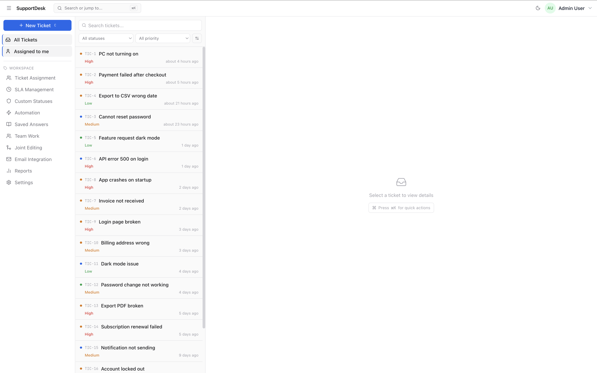
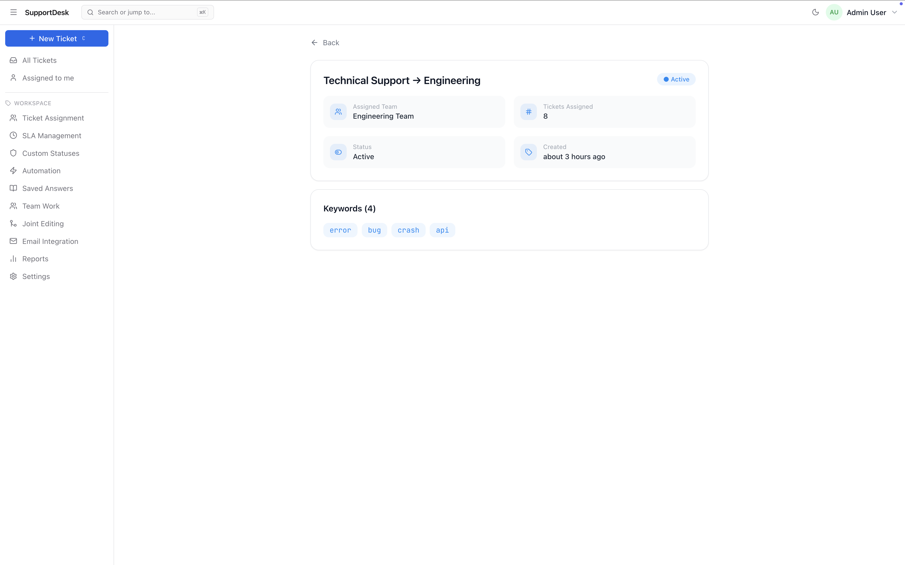
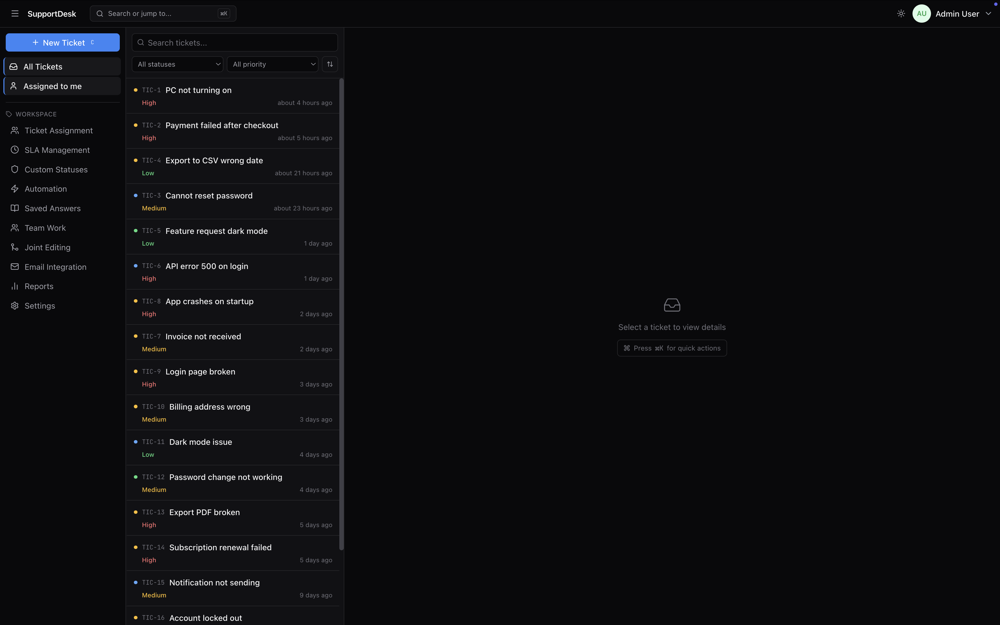

# 🎫 TicketDesk

### A fast, keyboard-first support ticketing platform with a split-view workspace and real-time collaboration

🔗 **[Live Demo](https://supportdesk-ai-five.vercel.app)**

---

## 📖 Overview

**TicketDesk** is a modern B2B support tool for managing the full lifecycle of customer tickets — built around a **split-view (master-detail) workspace** inspired by Linear and GitHub Issues. The list lives on the left, the ticket detail on the right, and everything is driven by the URL and the keyboard: no full-page reloads, instant status changes, and live collaboration between agents.

The project was built as a **full-stack portfolio piece** to demonstrate end-to-end skills: a normalized PostgreSQL schema, a typed REST API, and a polished React frontend with optimistic UI, URL-driven state, keyboard navigation, and dark mode.

---

## 📸 Screenshots

---

## ✨ Key Features

### 🎟️ Split-View Ticket Workspace
- **Master-detail layout** — dense ticket list on the left, full detail on the right, each scrolling independently
- **URL-driven state** — selecting a ticket updates the URL (`?ticketId=104`); opening a direct link activates the ticket instantly
- **Keyboard navigation** — `↑ / ↓` to move between tickets, `C` to create, `Cmd/Ctrl + K` for the command palette
- **Optimistic UI** — status and priority changes reflect instantly and reconcile with the server, rolling back on error
- Inline-editable title, Markdown-friendly description, and a full activity/comment thread

### 🤖 Automation & Assignment
- **Assignment Rules** — auto-route new tickets to teams based on keywords
- **Automation Rules** — trigger actions (close, notify, reassign) on conditions
- Toggle rules on/off with instant optimistic updates

### 📊 SLA Management
- Define SLA policies with first-response and resolution targets per priority
- Live compliance tracking and breach detection with overdue calculations

### 👥 Teams & Collaboration
- Manage support teams and members
- **Joint Editing** — real-time collaborative sessions with live chat via **WebSockets**
- See who's online and working on each ticket

### 📧 Email Integration
- Connect and manage multiple mailboxes (Gmail, Outlook, SMTP)
- Activity cards with received/sent stats and a 7-day chart

### 📈 Reports & Analytics
- Charts for ticket trends and response times
- Agent performance table with date-range filtering

### ⚙️ UX
- **Dark mode** with system-aware theme persistence
- **Command palette** (`Cmd+K`) for quick search and actions
- **Skeleton loaders** for content-aware loading
- **Fully responsive** — collapsible sidebar and mobile layout

### 🔒 Security
- **JWT authentication** with role-based access control
- **Input validation** — all endpoints validated with Zod
- **Rate limiting** via `express-rate-limit`
- **Helmet.js** security headers

---

## 🛠️ Tech Stack

### Frontend
| Technology | Purpose |
|---|---|
| **React 19 + TypeScript** | UI with full type safety |
| **Vite** | Build tool & dev server |
| **React Router** | Client-side routing + URL-driven state |
| **TanStack Query** | Server-state, caching & optimistic updates |
| **Tailwind CSS** | Utility-first styling with CSS-variable theming |
| **Recharts** | Charts for reports |
| **Lucide React** | Icons |
| **react-hot-toast** | Toast notifications |

### Backend
| Technology | Purpose |
|---|---|
| **Node.js + Express** | REST API server |
| **TypeScript** | Type-safe backend |
| **PostgreSQL (Neon)** | Relational database |
| **Drizzle ORM** | Type-safe queries & migrations |
| **Zod** | Runtime schema validation |
| **JWT + bcrypt** | Auth & password hashing |
| **ws (WebSocket)** | Real-time collaboration |
| **Helmet · express-rate-limit** | Security headers & rate limiting |

---

## 🏗️ Architecture